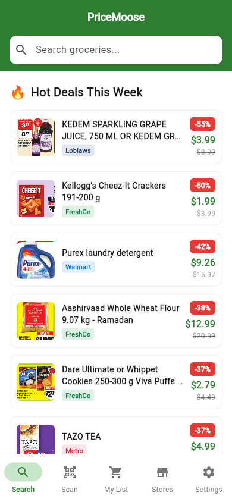
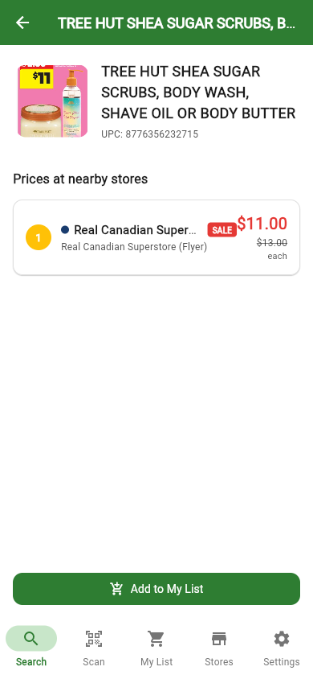
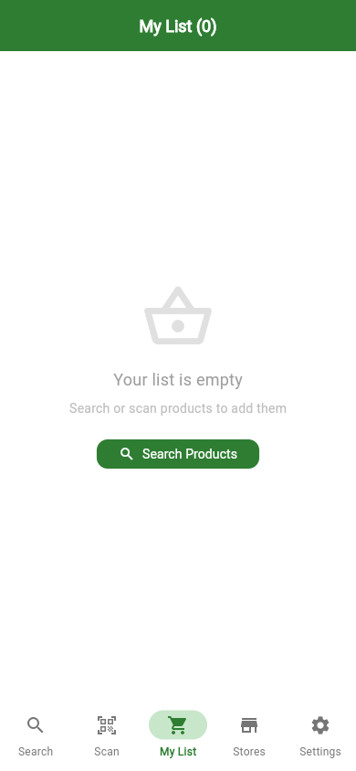
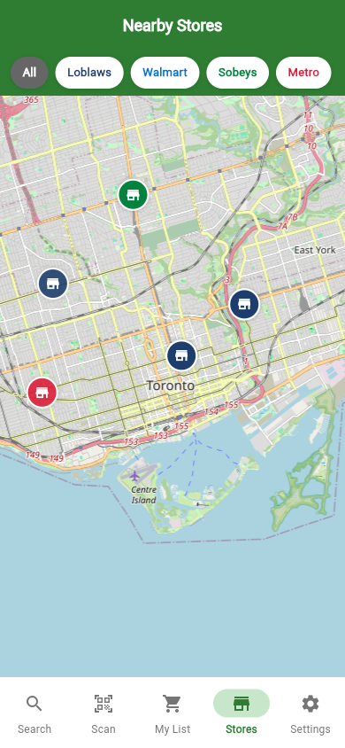
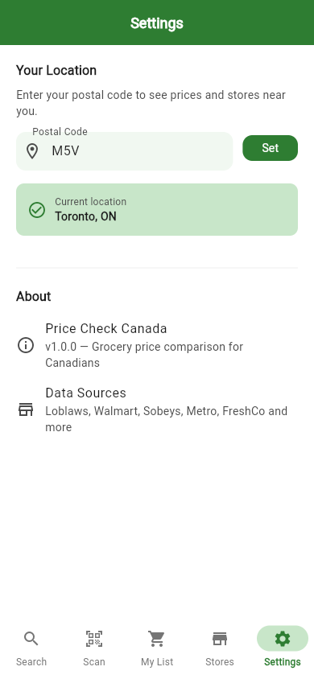

# 🫎 PriceMoose

**Compare grocery prices across Canada's major chains — in real time.**

PriceMoose is a Flutter mobile app backed by a Python scraping engine that pulls live pricing from Loblaws, Walmart Canada, Sobeys, and Metro. Search by product name or scan a barcode to instantly see where it's cheapest near you.

---

## Screenshots

| Search | Price Comparison | Shopping List |
|--------|-----------------|---------------|
|  |  |  |

| Basket Compare | Nearby Stores | Settings |
|----------------|---------------|----------|
|  |  |  |

---

## Features

| Feature | Description |
|---------|-------------|
| Barcode Scan | Scan any grocery barcode → instant price comparison |
| Product Search | Debounced full-text search across 800+ products |
| Price Ranking | Prices sorted cheapest-first with distance + sale badges |
| Shopping List | Build a cart, set quantities, persisted locally |
| Basket Compare | See total cost of your whole list at each nearby store |
| Nearby Stores | OpenStreetMap view with chain colour-coded markers |
| Postal Code | Set your location by Canadian postal code |

---

## Supported Chains

| Chain | Banners |
|-------|---------|
| Loblaws | Loblaws, No Frills, Real Canadian Superstore, Zehrs, Fortinos |
| Walmart | Walmart Canada |
| Sobeys | Sobeys, FreshCo, Safeway Canada, IGA |
| Metro | Metro, Food Basics |

---

## Tech Stack

**Mobile** — Flutter 3.22 · Riverpod · go_router · flutter_map · Hive · mobile_scanner

**Backend** — Python 3.12 · FastAPI · SQLAlchemy (async) · PostgreSQL · httpx · BeautifulSoup4

---

## Project Structure

```
pricemoose/
├── mobile/                  Flutter app
│   └── lib/
│       ├── app/             Router + app root
│       ├── core/            API client, theme, constants, postal lookup
│       ├── shared/          Freezed models + reusable widgets
│       └── features/        search/ barcode/ product_detail/
│                            shopping_list/ stores/ settings/
│
└── backend/
    └── app/
        ├── main.py          FastAPI entry point
        ├── models/          SQLAlchemy ORM (Product, Store, Price)
        ├── api/routes/      REST endpoints
        └── scrapers/        One scraper per chain + base class
```

---

## API Reference

| Endpoint | Description |
|----------|-------------|
| `GET /products/search?q=` | Full-text product search |
| `GET /products/upc/{upc}` | Look up product by barcode |
| `GET /prices/{upc}?lat=&lng=&radius_km=` | Prices sorted cheapest first |
| `GET /stores/nearby?lat=&lng=&chain=` | Stores near a location |
| `POST /lists/compare` | Compare basket total across stores |

---

## Running Locally

### Backend

```bash
cd backend
python -m venv .venv && source .venv/bin/activate
pip install -r requirements.txt
uvicorn app.main:app --reload       # http://localhost:8000
python scrape_tier1.py              # seed initial data
```

### Flutter (web / Android)

```bash
cd mobile
flutter pub get
flutter run -d chrome --web-port 3000
```

> For Android: update `lib/core/constants.dart` → `ApiConstants.baseUrl` to your LAN IP.

---

## Legal Note

PriceMoose retrieves publicly available pricing from retailer websites.
All prices are for informational purposes only. Scraping is rate-limited
and cached to minimize impact on retailer infrastructure.
